<h1 align="center"># README - Itinera ✈️ </h1>


<p align="center">Proyecto 7 - Frontend Itinera PHP + Laravel</p>

<p align="center">Frontend de una Web App con temática de viajes, realizado por Bienve Ladrón.
<br>
Desarrollado como parte del Bootcamp de Full Stack Developer de Geekshubs Academy.</p>

<p>
   <div align="center">
      
   </div>    
</p>

<p>
   <div align="center">
      <em><b>Bienvenido a mi proyecto final</b></em>
   </div>   
<p align="center">_______________________________________________</p>


## ¿Qué es Itinera?
<p>
Esta aplicación web está pensada para ofrecer una solución cómoda a aquellos usuarios que quieren viajar y no tienen experiencia o tiempo para planificar sus viajes, brindándole una solución  predefinida, rápida y fácil. Para ello se tendrá en cuenta el destino y las fechas del viaje. Además también podrán modificar la agenda de viaje, en el caso de que la primera propuesta no fuese de su agrado, actuando así como una agenda de viaje totalmente personalizada.

El proyecto consiste en desarrollar una aplicación web llamada " Itinera”, que te sugerirá a partir de un destino y unas fechas seleccionadas previamente, un itinerario y unas actividades diarias. Además permitirá a los usuarios planificar, organizar y seguir sus viajes de manera personalizada. La aplicación se centrará en proporcionar una experiencia intuitiva y social, permitiendo a los usuarios explorar destinos, modificar su agenda de viaje y compartir experiencias.

Para Visualizar el Back puedes acceder haciendo click aquí :
- Back → PHP + Laravel: [Repositorio GitHub Back](https://github.com/ladronbx/itinera-proyecto-final.git)

---

## Tabla de Contenidos

<details>

  <summary>📋 Apartados</summary>
<ol>
    <li>🚀 <a href="#introducción">Introducción</a></li>
    <li>🎯 <a href="#descripción-del-proyecto">Descripción del proyecto</a></li>
    <li>👀 <a href="#vistas">Vistas</a></li>
    <li>🔧 <a href="#tecnologías-utilizadas">Tecnologías utilizadas</a></li>
    <li>🚀 <a href="#deploy">Deploy</a></li>
    <li>🍃 <a href="#ramas-del-repositorio">Ramas del repositorio</a></li>
    <li>🚧 <a href="#problemas-y-soluciones">Problemas y soluciones</a></li>
    <li>📁<a href="#estructura-directorios">Estructura directorios</a></li>
    <li>📦 <a href="#instrucciones-dockerización">Instrucciones dockerización</a></li>
    <li>🌐 <a href="#enlaces-importantes">Enlaces importantes</a></li>
    <li>🤝 <a href="#cómo-contribuir">Como contribuir</a></li>
    <li>📧 <a href="#contacto">Contacto</a></li>
    <li>👏 <a href="#agradecimientos">Agradecimientos</a></li>
    
  </ol>

</details>

## Introducción

🚀 En este proyecto, he creado un Frontend completo para una aplicación web llamada "Itinera", centrada en la planificación de viajes. Como parte de mi formación en el Bootcamp de Full Stack Developer de Geekshubs Academy, he empleado tecnologías como PHP, Laravel, MySQL, GIT y GitHub en el desarrollo del servidor.

Este frontend proporciona una interfaz de usuario amigable y funcional para la aplicación web Itinera. A continuación, encontrarás información sobre la estructura del proyecto, su funcionalidad principal, y cómo puedes contribuir o realizar la configuración del entorno de desarrollo utilizando Docker.

## Descripción del Proyecto
🎯 Itinera es una aplicación web diseñada para facilitar la planificación de viajes. Dirigida a usuarios que desean una solución rápida y personalizada para organizar sus viajes, Itinera sugiere itinerarios y actividades diarias basándose en el destino y las fechas seleccionadas. Los usuarios tienen la flexibilidad de modificar la agenda propuesta según sus preferencias, convirtiendo así la aplicación en una herramienta de planificación de viajes totalmente personalizada.

## Vistas
👀 

- Home:
<p>
   <div align="center">
      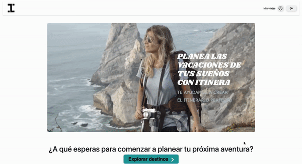
   </div>    
</p>

- Register:
<p>
   <div align="center">
      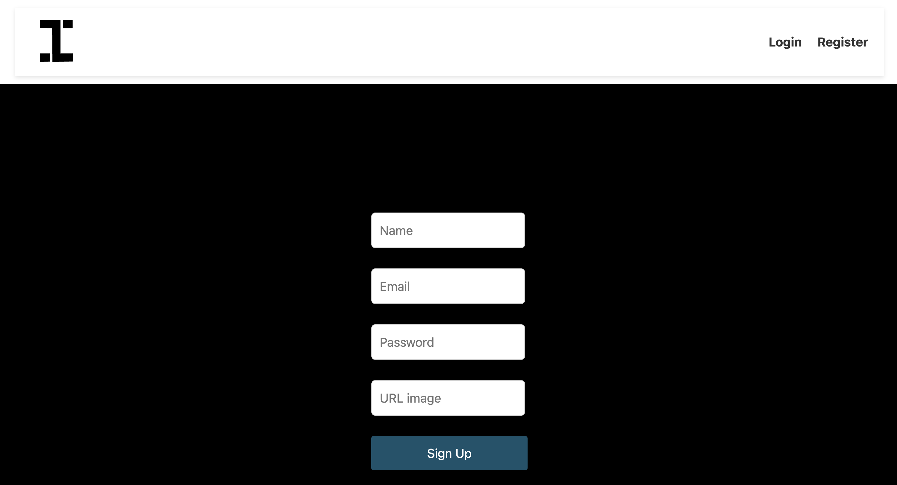
   </div>    
</p>


- Login:
<p>
   <div align="center">
      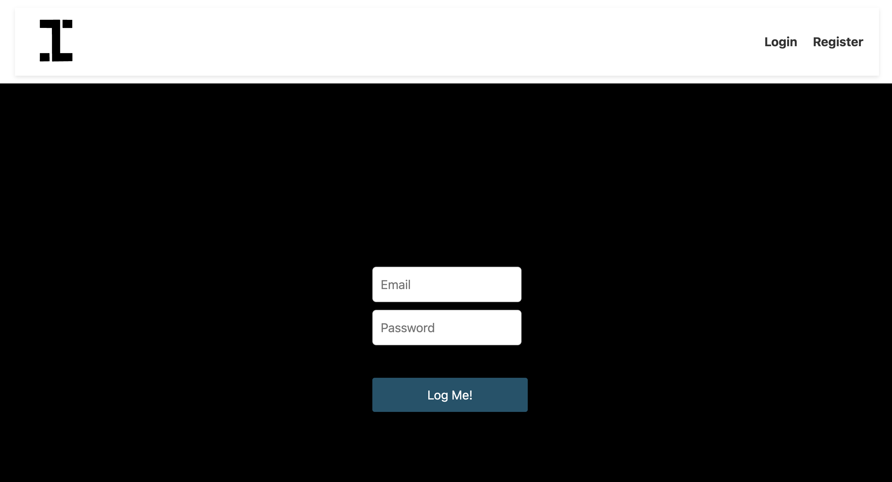
   </div>    
</p>


- Profile:
<p>
   <div align="center">
      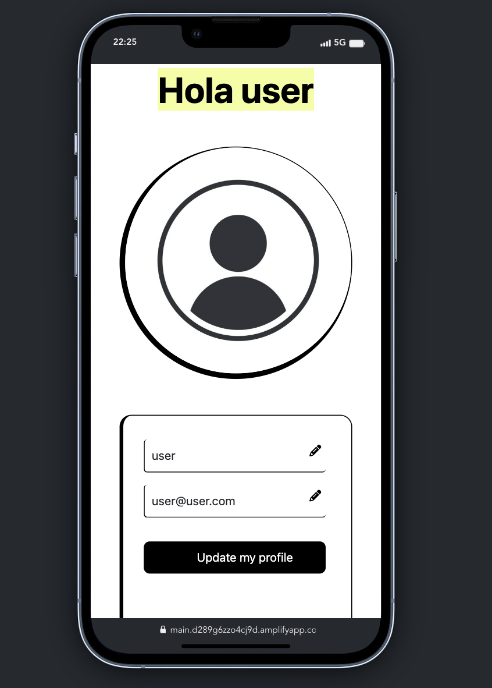
   </div>
      <div align="center">
      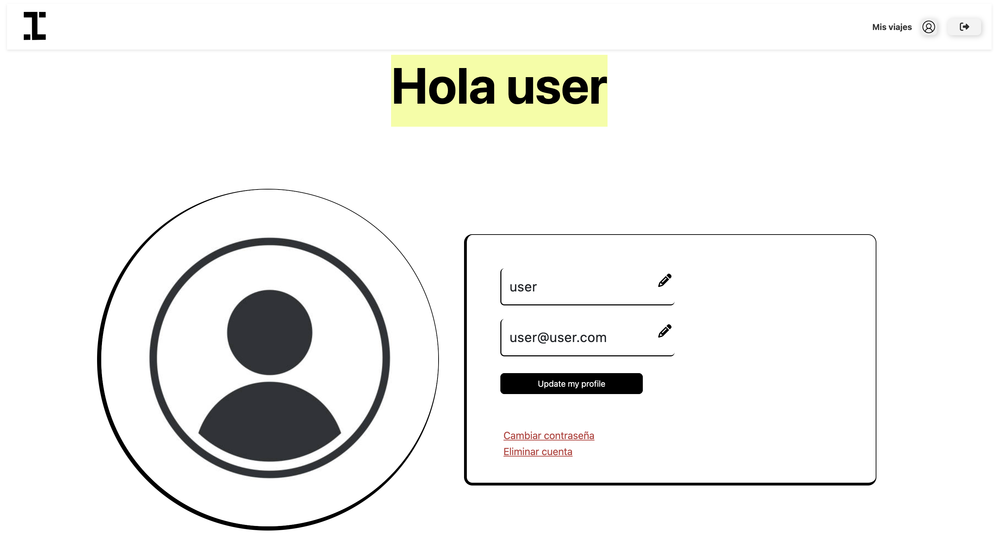
   </div>    
</p>

- Selección destino:

<p>
   <div align="center">
      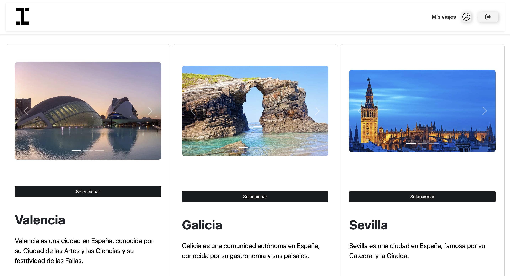
   </div>    
</p>

- Agregar actividades:
<p>
   <div align="center">
      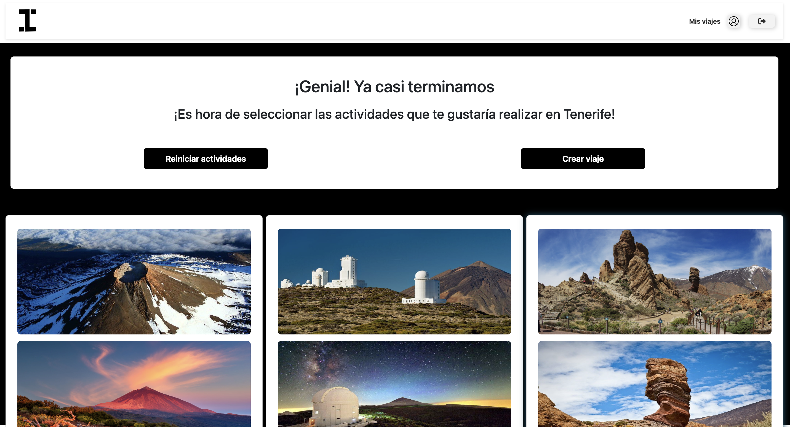
   </div>    
</p>

<p>
   <div align="center">
      
   </div>    
</p>


- Mis viajes:
<p>
   <div align="center">
      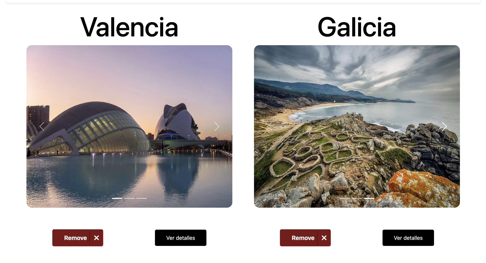
   </div>    
</p>

- Mi viaje en detalle:

<p>
   <div align="center">
      
      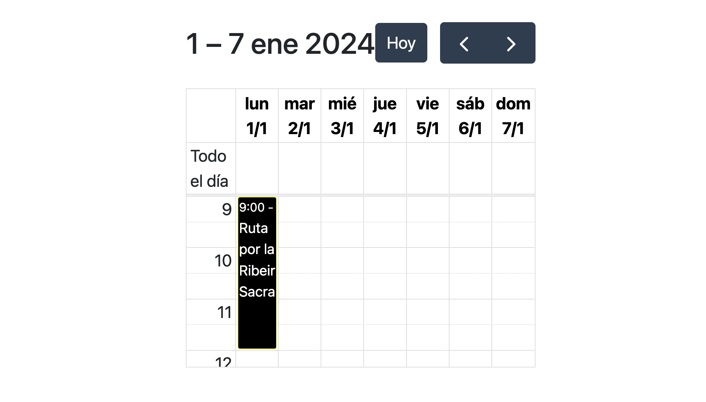
      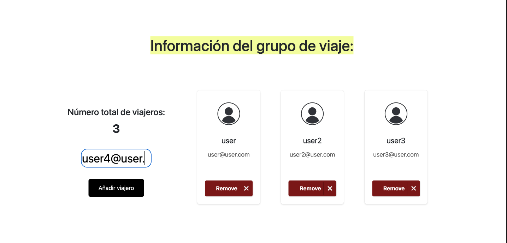
      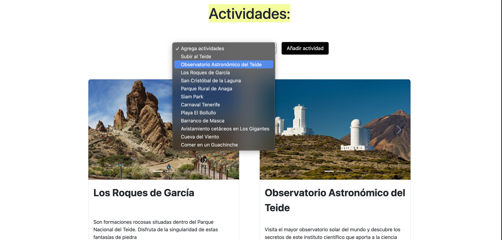
   </div>  
</p>

- Mi viaje en detalle:
<p>
   <div align="center">
      
   </div>    
</p>


## Estructura directorios
<details>
<summary><h3>Resumen directorios</h3></summary>
```
└── 📁proyecto-final-front-react
    └── .DS_Store
    └── 📁.vite
    └── README.md
    └── amplify.yml
    └── 📁img
        └── geekhubs.png
        └── gif-thunder.gif
        └── img-bbdd.png
        └── img-footer-geek.png
        └── img-problema-token-2.png
        └── img-problema-token.png
    └── index.html
    └── package-lock.json
    └── package.json
    └── 📁public
        └── vite.svg
    └── 📁src
        └── .DS_Store
        └── App.css
        └── App.jsx
        └── 📁app
            └── store.js
        └── 📁assets
            └── 📁img
                └── 📁img-home
                    └── video-home.mp4
                └── img-profile.png
                └── logo.svg
            └── react.svg
        └── 📁common
            └── .DS_Store
            └── 📁ActivityCard
                └── ActivityCard.css
                └── ActivityCard.jsx
            └── 📁ActivityCardDetail
                └── ActivityCardDetail.css
                └── ActivityCardDetail.jsx
            └── 📁CardUser
                └── CardUser.css
                └── CardUser.jsx
            └── 📁CreateActivitySuper
                └── CreateActivitySuper.css
                └── CreateActivitySuper.jsx
            └── 📁CreateLocationSuper
                └── CreateLocationSuper.css
                └── CreateLocationSuper.jsx
            └── 📁CustomInput
                └── CustomInput.css
                └── CustomInput.jsx
            └── 📁EditButton
                └── EditButton.css
                └── EditButton.jsx
            └── 📁Header
                └── Header.css
                └── Header.jsx
            └── 📁LinkButton
                └── LinkButton.css
                └── LinkButton.jsx
            └── 📁LocationCard
                └── LocationCard.css
                └── LocationCard.jsx
            └── 📁LogOutButton
                └── LogOutButton.css
                └── LogOutButton.jsx
            └── 📁PaginationButton
                └── PaginationButton.css
                └── PaginationButton.jsx
            └── 📁PasswordModal
                └── PasswordModal.jsx
            └── 📁RemoveButtonActivity
                └── RemoveButtonActivity.css
                └── RemoveButtonActivity.jsx
            └── 📁RemoveButtonActivitySuper
                └── RemoveButtonActivitySuper.css
                └── RemoveButtonActivitySuper.jsx
            └── 📁RemoveButtonLocationSuper
                └── RemoveButtonLocationSuper.css
                └── RemoveButtonLocationSuper.jsx
            └── 📁RemoveButtonMemberGroup
                └── RemoveButtonMemberGroup.css
                └── RemoveButtonMemberGroup.jsx
            └── 📁RemoveButtonTrip
                └── RemoveButtonTrip.css
                └── RemoveButtonTrip.jsx
            └── 📁RemoveButtonTripSuper
                └── RemoveButtonTripSuper.css
                └── RemoveButtonTripSuper.jsx
            └── 📁RemoveButtonUserSuper
                └── RemoveButtonUserSuper.css
                └── RemoveButtonUserSuper.jsx
            └── 📁SelectDate
                └── SelectDate.css
                └── SelectDate.jsx
            └── 📁TripCalendar
                └── FullCalendarOverrides.css
                └── TripCalendar.jsx
            └── 📁TripCard
                └── TripCard.css
                └── TripCard.jsx
            └── 📁TripCardDetailMember
                └── TripCardDetailMember.css
                └── TripCardDetailMember.jsx
            └── 📁TripCardSuper
                └── TripCardSuper.css
                └── TripCardSuper.jsx
        └── index.css
        └── main.jsx
        └── 📁pages
            └── .DS_Store
            └── 📁Activity
                └── Activity.css
                └── Activity.jsx
            └── 📁ActivitySuper
                └── ActivitySuper.css
                └── ActivitySuper.jsx
            └── 📁Body
                └── Body.jsx
            └── 📁GetAllUsers
                └── GetAllUsers.css
                └── GetAllUsers.jsx
            └── 📁Home
                └── Home.css
                └── Home.jsx
            └── 📁Location
                └── Location.css
                └── Location.jsx
            └── 📁LocationSuper
                └── LocationSuper.css
                └── LocationSuper.jsx
            └── 📁Login
                └── Login.css
                └── Login.jsx
            └── 📁Profile
                └── Profile.css
                └── Profile.jsx
            └── 📁Register
                └── Register.css
                └── Register.jsx
            └── 📁Trip
                └── Trip.css
                └── Trip.jsx
            └── 📁TripDetail
                └── TripDetail.css
                └── TripDetail.jsx
            └── 📁TripSuper
                └── TripSuper.css
                └── TripSuper.jsx
            └── tripSlice.js
            └── userSlice.js
        └── 📁services
            └── apiCall.js
            └── checker.js
    └── vite.config.js
```
</details>

### Tecnologias

🔧 Tecnologías


El frontend ha sido desarrollado utilizando las siguientes tecnologías: React, Redux,  Javascript, HTML, Bootstrap, CSS, GIT y GitHub.
</br>
</br>
[]()
[]()
[]()
[]()
[]()
</br>
</br>

## Deploy AWS

El proyecto ha sido deployado utilizando servicios de AWS.

🚀 Puedes acceder al sitio desplegado [aquí](https://main.d289g6zzo4cj9d.amplifyapp.com/)

## Ramas del repositorio

🍃 Este proyecto se ha desarrollado en las siguientes ramas:

Claro, aquí están las ramas numeradas y formateadas en Markdown:

1. **Master**: 
    - Considerada como la rama principal, en ella únicamente se ha iniciado y finalizado el proyecto para poder hacer el deploy.

2. **Dev**: 
    - Es la rama sobre la que pivotan todas las features.

3. **feature/activity-page**: 
   - Esta rama se centra en el desarrollo de la funcionalidad relacionada con la página de actividades.
   - Aquí se implementan y prueban nuevas características relacionadas con las actividades del itinerario.

4. **feature/dynamic-header**: 
   - En esta rama, se trabaja en la implementación de un encabezado dinámico que puede adaptarse según el contexto de la página.
   - Se busca mejorar la experiencia del usuario mediante la personalización del encabezado.

5. **feature/home-page**: 
   - Desarrollo específico de la página de inicio.
   - Aquí se trabajan los elementos y la lógica relacionada con la visualización y navegación en la página principal de la aplicación.

6. **feature/login-page**: 
   - Enfocada en el diseño y funcionalidad de la página de inicio de sesión.
   - Se implementan características relacionadas con la autenticación y la gestión de sesiones de usuario.

7. **feature/profile-page**: 
   - Desarrollo de la página de perfil de usuario.
   - Se implementan funciones para ver y editar la información del perfil de usuario.

8. **feature/register-page**: 
   - Rama destinada a la creación y mejora de la página de registro de nuevos usuarios.
   - Aquí se gestionan las funciones relacionadas con la creación de cuentas.

9. **feature/style**: 
   - En esta rama se realiza el trabajo dedicado a la mejora del estilo y la apariencia general de la aplicación.
   - Se implementan cambios de diseño y estilos visuales.

10. **feature/trip-page**: 
    - Desarrollo específico de la página de viajes.
    - Aquí se implementan y prueban las funciones relacionadas con la gestión de viajes y la visualización de itinerarios.

11. **fix/update-profile**: 
    - Rama dedicada a la corrección de errores específicos relacionados con la actualización del perfil de usuario.

## Problemas y Soluciones

### 1. Conexión Frontend con frontend React.

- **🚧Problema**: CORS.

   - **💡Solución**: 
   1. Instalar → `composer require fruitcake/laravel-cors` o `composer update`
   
   2. En app/Http/Kernel.php :
    
    ```bash
    protected $middleware = [
    // \App\Http\Middleware\TrustHosts::class,
    \App\Http\Middleware\TrustProxies::class,
    \Fruitcake\Cors\HandleCors::class, // Aquí es donde lo cambias
    \App\Http\Middleware\PreventRequestsDuringMaintenance::class,
    \Illuminate\Foundation\Http\Middleware\ValidatePostSize::class,
    \App\Http\Middleware\TrimStrings::class,
    \Illuminate\Foundation\Http\Middleware\ConvertEmptyStringsToNull::class,
    ];
    ```


### 2. Problema Redux persist - register2.

- **🚧Problema**: Redux persist.
   <div align="center">
      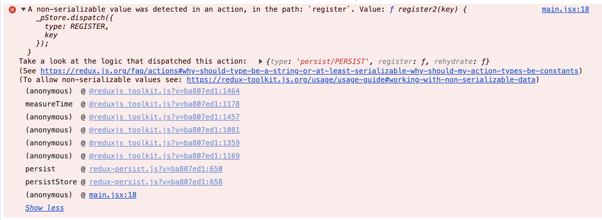
   </div>   

   - **💡Solución**: 
    ```bash
   main.jsx:18 A non-serializable value was detected in an action, in the path: `register`. Value: ƒ register2(key) {
    _pStore.dispatch({
      type: REGISTER,
      key
    });
  }

    ```


   <div align="center">
      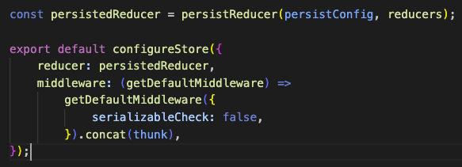
   </div>   


### Instrucciones Dockerización

📦 Para facilitar la implementación y ejecución del proyecto, se proporcionan instrucciones de Dockerización:

1. **Clonar el Repositorio:**

    ```bash
    git clone https://github.com/ladronbx/itinera-proyecto-final-react.git
    ```

2. **Acceder al Directorio del Proyecto:**

    ```bash
    cd itinera-proyecto-final-react
    ```

3. **Configuración de Variables de Entorno:**

    - Crea un archivo `.env` basado en el ejemplo `.env.example` y configura las variables de entorno necesarias según las necesidades de tu aplicación.

4. **Construir y Levantar Contenedores:**

    ```bash
    # Construir la imagen de Docker
    docker build -t nombre-de-tu-imagen .

    # Ejecutar el contenedor
    docker run -p 3000:3000 -d nombre-de-tu-imagen
    ```

    Estos comandos construirán la imagen de Docker utilizando el Dockerfile proporcionado y ejecutarán un contenedor basado en esa imagen. El flag `-p 3000:3000` mapea el puerto 3000 del contenedor al puerto 3000 del host. Ajusta el nombre de la imagen según tu preferencia.

5. **Acceder a la Aplicación:**

    Una vez que el contenedor esté en ejecución, puedes acceder a tu aplicación ReactJS en el navegador utilizando la siguiente URL:

    ```
    http://localhost:3000
    ```

    ¡Tu aplicación ReactJS con Vite ahora está dockerizada y lista para ser utilizada en cualquier entorno compatible con Docker!

6. **Detener y Eliminar el Contenedor:**

    Si necesitas detener y eliminar el contenedor, puedes utilizar los siguientes comandos:

    ```bash
    # Listar contenedores en ejecución
    docker ps

    # Detener el contenedor (reemplaza CONTAINER_ID con el ID real de tu contenedor)
    docker stop CONTAINER_ID

    # Eliminar el contenedor (reemplaza CONTAINER_ID con el ID real de tu contenedor)
    docker rm CONTAINER_ID
    ```


## Enlaces Importantes

🌐 Mediante estos enlaces puedes acceder a ellos:

- **[Documentación de Laravel](https://laravel.com/docs)**
- **[laravel/passport Documentation](https://laravel.com/docs/8.x/passport)**
- **[GeeksHubs Academy](https://www.geekshubsacademy.com/)**


## Cómo Contribuir

🤝 Si deseas contribuir a este proyecto, puedes realizar un fork del repositorio en GitHub, hacer tus cambios y enviar una solicitud de extracción (pull request). Tu contribución será revisada y, si es apropiada, se fusionará con la rama principal.

1. Haz un fork de este repositorio.

2. Crea una nueva rama para tu contribución: `git checkout -b tu-nueva-caracteristica`.

3. Realiza tus cambios y commitea: `git commit -m "Añade una nueva característica"`.

4. Envía tus cambios al repositorio: `git push origin tu-nueva-caracteristica`.

5. Crea una solicitud de extracción en GitHub.

Espero que disfrutes explorando y utilizando este Frontend. Si tienes alguna pregunta o necesitas asistencia, no dudes en ponerte en contacto con nosotros a través de la información de contacto proporcionada.

## Contacto

📧 Para cualquier pregunta o comentario, no dudes en ponerte en contacto:

- **Bienve Ladrón**

<a href = "[mailto:ladronbravovlc@gmail.com](mailto:ladronbravovlc@gmail.com)"></a>

<a href="https://github.com/ladronbx" target="_blank"></a>

- *Fecha de Comienzo del Proyecto**: 11/11/2023

## Agradecimientos

👏 Agradecimentos a GeeksHubs Academy por los conocimientos que hemos podido adquirir a lo largo de todo el curso y que han hecho posible este proyecto, y a nuestros queridos profesores David Ochando y Dani Tarazona y su gran paciencia con nosotros.

<p>

   <div align="center">
    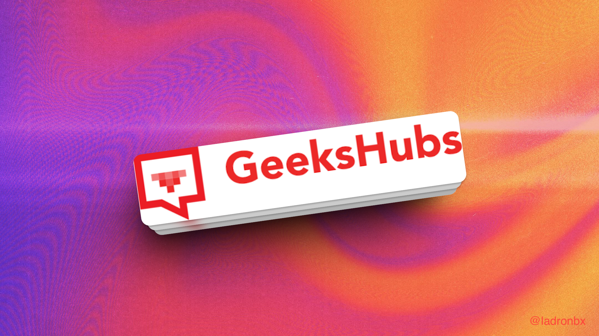
   </div>

</p>

